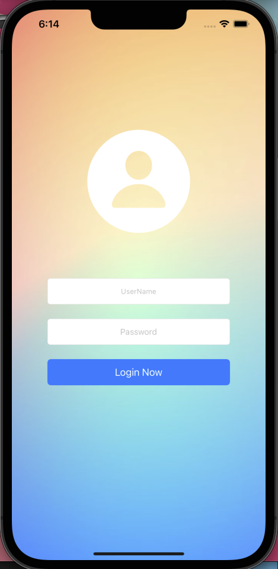
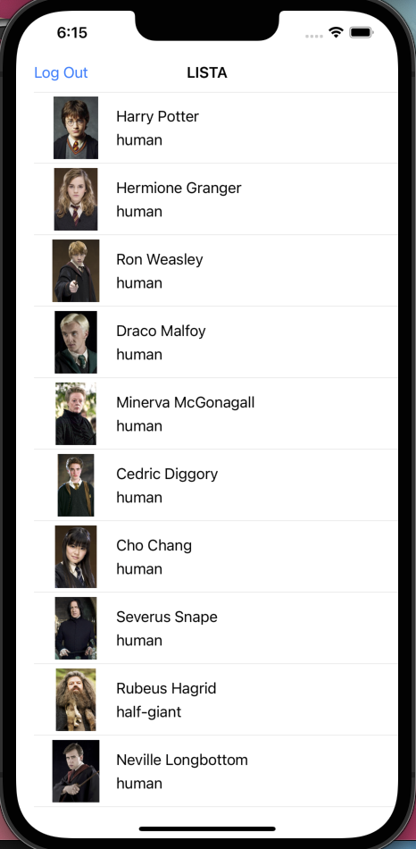
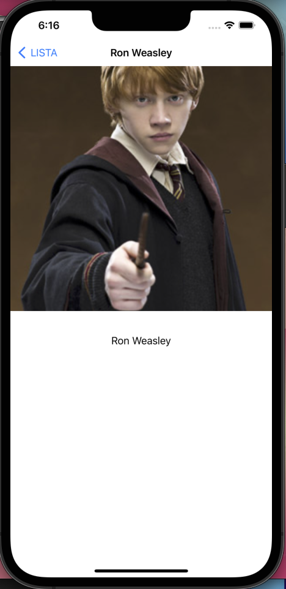
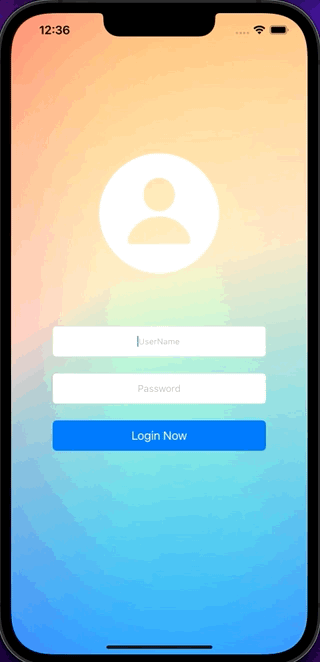

# Harry Potter App With UIKit

App creada en UIKit con arquitectura MVC.

La aplicación consta de una pantalla de login con navegación a un listado de los personajes con un API Rest y navegación al detalle de cada personaje.

App actualmente en desarrollo.

